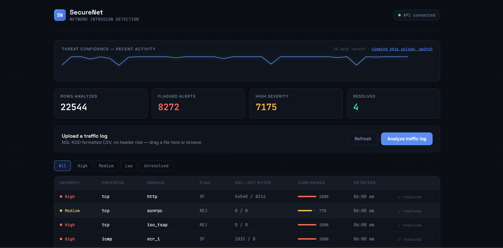

# SecureNet — Network Intrusion Detection System

A full-stack network intrusion detector that uses a trained machine learning model to classify network traffic as normal or malicious, with a live dashboard for reviewing and resolving alerts.

## What it does

SecureNet ingests network traffic logs (in the standard NSL-KDD format) and uses a trained Random Forest classifier to flag suspicious connections in real time. Rather than relying on a single hardcoded rule or threshold, the model evaluates each connection across dozens of features — protocol, service, connection flags, byte counts, error rates, and more — and returns a confidence score for how likely it is to be an attack.

Flagged connections are stored in MongoDB and surfaced in a dashboard where they can be filtered by severity and marked as resolved.

## Tech stack

- **Backend:** Python, Flask, Flask-CORS
- **Machine learning:** scikit-learn (Random Forest Classifier), pandas, joblib
- **Database:** MongoDB
- **Frontend:** HTML, CSS, vanilla JavaScript (no framework)

## Architecture

```
sample_data/          NSL-KDD dataset files (train + test splits)
backend/
  train_model.py      Trains and evaluates the model, saves it to disk
  detection.py         Loads the trained model, runs predictions on uploaded logs
  db.py                MongoDB connection helper
  app.py                Flask API — upload, alerts, resolve, stats endpoints
  model.pkl, scaler.pkl,
  encoders.pkl, feature_columns.pkl   Trained model artifacts
frontend/
  index.html            Dashboard UI
```

## Model methodology

The model is trained on the **NSL-KDD** dataset, a well-established benchmark for intrusion detection research. Traffic is classified as a binary problem: `normal` vs. `attack` (collapsing 22 distinct attack subtypes present in the raw data into a single positive class).

**Training and evaluation use separate files** — `KDDTrain.txt` for training, `KDDTest+.txt` for evaluation — to avoid data leakage. This matters because the test set contains **17 attack types that never appear in training** (e.g. `mailbomb`, `worm`, `processtable`, `snmpguess`), which is the standard, intended way to evaluate on this benchmark: it tests whether a model generalizes to novel attacks rather than memorizing known ones.

The pipeline:
1. Categorical features (`protocol_type`, `service`, `flag`) are label-encoded
2. Numeric features are standardized
3. A Random Forest classifier is tuned via `GridSearchCV` with 3-fold cross-validation
4. The final model is evaluated once, on the held-out `KDDTest+.txt` file

### Results

| Metric | Score |
|---|---|
| Precision | 96.7% |
| Recall | 62.3% |
| F1 Score | 75.8% |
| ROC-AUC | 0.963 |

**Why recall isn't higher:** the test set includes attack types the model never saw during training. This is a known, published characteristic of the NSL-KDD benchmark — academic work on this dataset commonly reports F1 scores in a similar 0.75–0.80 range for binary classification. High precision with moderate recall reflects a realistic tradeoff: the model rarely raises a false alarm, but it will miss genuinely novel attack techniques — the same limitation real-world intrusion detection systems face when adversaries use previously unseen methods.

An earlier version of this project used a single-feature z-score threshold on synthetic traffic data (see `sample_data/archive/`). It was replaced with this model-based approach after that method proved too weak to catch real attack patterns.

## API endpoints

| Endpoint | Method | Description |
|---|---|---|
| `/api/analyze` | POST | Upload a traffic log (form-data key: `traffic_log`), returns flagged alerts |
| `/api/alerts` | GET | Fetch stored alerts, optional `?severity=` or `?batch_id=` filters |
| `/api/alerts/<id>/resolve` | POST | Mark an alert as resolved |
| `/api/stats` | GET | Total rows analyzed, optionally scoped to a `?batch_id=` |
| `/api/health` | GET | Health check |

## Setup

### Prerequisites
- Python 3.10+
- MongoDB running locally on `mongodb://localhost:27017/`

### Install and run

```bash
# from the project root
cd backend
pip install -r requirements.txt

# train the model (only needed once, or to retrain)
python train_model.py

# start the API
python app.py
```

The API runs at `http://127.0.0.1:5000`.

Open `frontend/index.html` directly in a browser to use the dashboard.

## Dashboard

The dashboard shows a live confidence "pulse" across recent traffic, summary stats (rows analyzed, flagged alerts, high-severity count, resolved count), and a filterable, severity-coded alert table. Uploading a new traffic log runs it through the model immediately and displays results for that specific upload, with the option to switch to viewing all historical alerts.



## Known limitations

- Recall on novel/unseen attack types is moderate (~62%), reflecting a real and well-documented challenge in intrusion detection rather than a modeling error — see Results above.
- This is a batch-analysis tool (upload a log, get results), not a live packet sniffer — it does not capture traffic in real time.
- Flask's development server is used for local demonstration; a production deployment would require a WSGI server (e.g. Gunicorn) and disabling debug mode.
